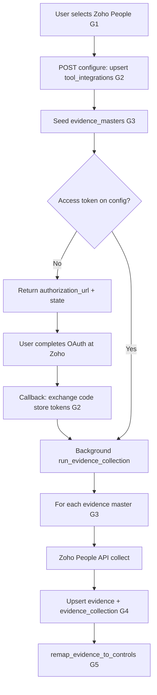

# Zoho People — HRMS integration (complete flow)

This document is the **Zoho People–specific** walkthrough aligned with the code under [`app/integrations/categories/hrms/zoho_people/`](../app/integrations/categories/hrms/zoho_people/). The **generic** rules for tables, uniqueness, and control mapping live in **[0001 - initialising.md](0001%20-%20initialising.md)**. Generic steps are labeled **G1–G5** below.

For **performance caveats and failure modes**, see **[0003 - zoho_people_bottlenecks.md](0003%20-%20zoho_people_bottlenecks.md)**.

For **Microsoft Entra (IDP)**, see **[0004 - microsoft_entra_integration.md](0004%20-%20microsoft_entra_integration.md)**.

---

## Relationship to `0001 - initialising.md`

| Generic step | What it means for Zoho People |
|--------------|------------------------------|
| **G1** — User selects tool and supplies data | User picks **Zoho People** (HRMS) and submits **`ToolIntegrationPayload`** (see below), or resumes from saved integration. |
| **G2** — Persist in `tool_integrations` | One row per `(organization_id, tool_id)`; store OAuth settings and tokens in **`configuration_data`**. Updates are **full replace** on that JSON object (no partial merge). |
| **G3** — Resolve `evidence_masters` | **POST …/configure** seeds masters from [`seed.py`](../app/integrations/categories/hrms/zoho_people/seed.py). Collectors use **`code`** (e.g. `HR_EMPLOYEE_MASTER`) and master **`name`** must match **`evidence.title`**. |
| **G4** — `evidence` + `evidence_collection` | Call Zoho People APIs with **`Zoho-oauthtoken`**; **`upsert_evidence_full_replace`**; **`insert_evidence_collection`** with `source` = `Zoho People API`. |
| **G5** — `evidence_mappeds` | **`remap_evidence_to_controls`** links **`evidence.id`** to controls via **`control_evidence_master`** for this **`evidence_master_id`**. |

**Uniqueness** (from `0001`):

- **`tool_integrations`**: unique `(organization_id, tool_id)` — always **update** the same row.
- **`evidence`**: unique `(organization_id, title)` per org — re-collection **updates** that row.

---

## Provider registry and code layout

| Item | Value |
|------|--------|
| Registry key | `zoho_people` ([`registry.py`](../app/integrations/core/registry.py)) |
| Category | `hrms` |
| Package | [`app/integrations/categories/hrms/zoho_people/`](../app/integrations/categories/hrms/zoho_people/) |
| OAuth + token helpers | [`oauth.py`](../app/integrations/categories/hrms/zoho_people/oauth.py), [`credentials.py`](../app/integrations/categories/hrms/zoho_people/credentials.py), [`regions.py`](../app/integrations/categories/hrms/zoho_people/regions.py) |
| Evidence collectors | [`collector.py`](../app/integrations/categories/hrms/zoho_people/collector.py) |
| Orchestration | [`collection_runner.py`](../app/integrations/categories/hrms/zoho_people/collection_runner.py) |
| Seed | [`seed.py`](../app/integrations/categories/hrms/zoho_people/seed.py), [`seed_service.py`](../app/integrations/categories/hrms/zoho_people/seed_service.py) |
| Token refresh | [`token_refresh.py`](../app/integrations/categories/hrms/zoho_people/token_refresh.py) |
| HTTP routes | [`routers/configure.py`](../app/integrations/categories/hrms/zoho_people/routers/configure.py), [`routers/oauth.py`](../app/integrations/categories/hrms/zoho_people/routers/oauth.py), [`routers/evidence.py`](../app/integrations/categories/hrms/zoho_people/routers/evidence.py) |

Routes are mounted from [`app/integrations/api.py`](../app/integrations/api.py).

---

## HTTP API reference (FastAPI)

Assume base URL `http://localhost:8006` (see **`app_port`** in [`app/config.py`](../app/config.py)) unless your deployment differs.

### Configure and integration shell

| Method | Path | Purpose |
|--------|------|---------|
| POST | `/api/v1/integrations/zoho/configure` | Upsert **`tool_integrations`**, seed **`evidence_masters`**, return OAuth URL or start background collect if tokens exist. |
| POST | `/hrms/zoho/integrations` | Same as **configure** (alias path). |

**Request body** — `ToolIntegrationPayload`:

```json
{
  "org_id": "<organization UUID>",
  "user_id": "<user UUID>",
  "tool_id": "<Zoho People tool UUID>",
  "configuration_data": { }
}
```

### Flow, status, refresh

| Method | Path | Purpose |
|--------|------|---------|
| GET | `/api/v1/integrations/zoho/flow?org_id=&tool_id=` | Returns whether OAuth is complete, **`authorization_url`** if not, and **`state`**. |
| GET | `/api/v1/integrations/zoho/status?org_id=&tool_id=` | Returns integration row with **`configuration_data`** masked (tokens and secrets redacted). |
| POST | `/api/v1/integrations/zoho/refresh-tokens` | Body: `{ "org_id", "tool_id", "force": false }` — refreshes Zoho access token using **`refresh_token`**. |

### OAuth (browser)

| Method | Path | Purpose |
|--------|------|---------|
| GET | `/api/v1/oauth/zoho/authorize?org_id=&tool_id=` | Returns JSON with **`authorization_url`** and **`state`** (same as flow without extra narrative). |
| GET | `/hrms/zoho/callback` | OAuth redirect target; exchanges `code` for tokens. |
| GET | `/hrms/zoho-people/callback` | Same handler as **`/hrms/zoho/callback`** (alternate path for docs / app console). |

If **`post_oauth_success_redirect_url`** is set in [`app/config.py`](../app/config.py), successful callbacks **302** to that URL instead of returning JSON.

### Evidence collection

| Method | Path | Purpose |
|--------|------|---------|
| POST | `/api/v1/evidence/collect` | Run evidence collection for this org/tool (refresh token if needed). |

**Request body** — `CollectEvidenceBody`:

```json
{
  "org_id": "<organization UUID>",
  "user_id": "<user UUID>",
  "tool_id": "<Zoho People tool UUID>",
  "evidence_codes": ["HR_EMPLOYEE_MASTER"],
  "date_from": "2025-01-01",
  "date_to": "2025-12-31"
}
```

- **`evidence_codes`**: optional; omit to collect all seeded masters (in master name order).
- **`date_from` / `date_to`**: optional `YYYY-MM-DD`; used by collectors that support time ranges.

**Note:** After **configure** when tokens are **not** yet present, the API returns **`authorization_url`**. After OAuth completes, **evidence collection runs automatically in the background** when **`user_id`** is present on the integration. **POST /collect** is for **re-runs** or debugging.

---

## Unified sync API (all integrations — manual + cron)

Use **`POST /api/v1/integrations/sync`** to refresh evidence for **any** configured integration using one contract (same logic as provider-specific collect endpoints). Suitable for **scheduled jobs** and **manual refresh**.

| Method | Path |
|--------|------|
| POST | `/api/v1/integrations/sync` |

- **`provider_key`** (optional): `zoho_people` \| `microsoft_entra` \| `microsoft_entra_gcc_high`. If omitted, the server infers the provider from the first seeded **`evidence_masters.source`** for this **`tool_id`** (requires **configure** to have run at least once).
- Other fields match **`CollectEvidenceBody`**: **`evidence_codes`**, **`date_from`**, **`date_to`**.

Implementation: [`sync_dispatch.py`](../app/integrations/core/sync_dispatch.py), [`integration_sync.py`](../app/integrations/routers/integration_sync.py).

### Zoho People — example payloads for `/api/v1/integrations/sync`

**Minimal** (provider inferred from `evidence_masters.source` = `zoho_people` after configure):

```json
{
  "org_id": "019ce23e-66b9-71fa-8223-8d66f1925bd5",
  "user_id": "019ce23e-67e0-702e-957d-ab3af1f8a619",
  "tool_id": "019ce23d-c16d-7304-a8b5-3500e3cbadbc"
}
```

**Explicit `provider_key`** (recommended for **cron** so jobs do not depend on inference):

```json
{
  "org_id": "019ce23e-66b9-71fa-8223-8d66f1925bd5",
  "user_id": "019ce23e-67e0-702e-957d-ab3af1f8a619",
  "tool_id": "019ce23d-c16d-7304-a8b5-3500e3cbadbc",
  "provider_key": "zoho_people",
  "evidence_codes": ["HR_EMPLOYEE_MASTER", "HR_ACTIVE_EMPLOYEES"],
  "date_from": "2025-01-01",
  "date_to": "2025-12-31"
}
```

**Response** includes **`provider_key`** (resolved or echoed) and **`results`** per evidence master (same idea as **`POST /api/v1/evidence/collect`**).

---

## Initial `configuration_data` (after G1)

Typical first save (before OAuth completes):

```json
{
  "org_id": "019ce23e-66b9-71fa-8223-8d66f1925bd5",
  "user_id": "019ce23e-67e0-702e-957d-ab3af1f8a619",
  "tool_id": "019ce23d-c16d-7304-a8b5-3500e3cbadbc",
  "configuration_data": {
    "client_id": "1000.xxxxxxxxxxxxxxxxxxxxxxxxxxxxxxxx",
    "client_secret": "xxxxxxxxxxxxxxxxxxxxxxxxxxxxxxxxxxxxxxxx",
    "redirect_uri": "http://localhost:8006/hrms/zoho-people/callback",
    "region": "in"
  }
}
```

| Field | Purpose |
|-------|---------|
| **`client_id`** | Zoho API Console client identifier. |
| **`client_secret`** | Zoho client secret. |
| **`redirect_uri`** | Must match **exactly** what is registered in Zoho and the **same host:port** as this FastAPI process. |
| **`region`** | Zoho data region (e.g. `com`, `in`, `eu`, …) — drives Accounts and People base URLs. |

After OAuth, tokens are stored on the same row — typically under **`oauth_clients`** (list) with **`access_token`**, **`refresh_token`**, **`access_token_expires_at`**, **`people_base_url`**, etc. Treat the stored JSON as **full replace** on reconnect.

---

## Phase A — OAuth (prerequisite for API calls)

1. **Build authorize URL** — Zoho Accounts OAuth2 (`scope`, `client_id`, `redirect_uri`, `state`, `prompt=consent`, `access_type=offline`). See [`oauth.py`](../app/integrations/categories/hrms/zoho_people/oauth.py).
2. User opens URL, signs in, approves.
3. Zoho redirects to **`redirect_uri`** with **`code`** and **`state`** (state encodes `org_id` + `tool_id`).
4. **Token exchange** — POST to Zoho Accounts `/oauth/v2/token` with `grant_type=authorization_code`.
5. **Persist** tokens and derived fields (**`people_base_url`**, etc.) on **`tool_integrations`** — **full replace** of integration config payload as implemented.

**Automatic background collection:** after successful callback, **`run_evidence_collection_after_oauth_background`** runs (unless **`user_id`** is missing on the integration row).

---

## Phase B — Evidence inventory (G3)

**POST …/configure** calls **`seed_zoho_evidence_masters`** so each **`evidence_masters`** row exists for this **`tool_id`** (idempotent skip if code already present).

| # | `name` (also `evidence.title`) | `code` | Category |
|---|--------------------------------|--------|----------|
| 1 | Exit Employee Records | `HR_EXIT_EMPLOYEES` | HR_LIFECYCLE |
| 2 | Employee Master List | `HR_EMPLOYEE_MASTER` | HR_EMPLOYEE |
| 3 | Active Employees List | `HR_ACTIVE_EMPLOYEES` | HR_EMPLOYEE |
| 4 | Terminated Employees List | `HR_TERMINATED_EMPLOYEES` | HR_EMPLOYEE |
| 5 | Department Structure | `HR_DEPARTMENT_STRUCTURE` | HR_ORG |
| 6 | Reporting Hierarchy | `HR_REPORTING_STRUCTURE` | HR_ORG |
| 7 | Employee Email List | `HR_EMPLOYEE_EMAIL_LIST` | HR_ACCESS |
| 8 | Attendance Logs | `HR_ATTENDANCE_LOGS` | HR_ATTENDANCE |
| 9 | Timesheet Records | `HR_TIMESHEETS` | HR_ATTENDANCE |
| 10 | Leave Records | `HR_LEAVE_RECORDS` | HR_LEAVE |
| 11 | Training Completion Records | `HR_TRAINING_COMPLETION` | HR_TRAINING |
| 12 | Policy Acknowledgement Records | `HR_POLICY_ACKNOWLEDGEMENT` | HR_POLICY |
| 13 | New Hire Records | `HR_NEW_HIRES` | HR_LIFECYCLE |
| 14 | Exit Clearance Status | `HR_EXIT_CLEARANCE` | HR_LIFECYCLE |

`source` on **`evidence_masters`** is **`zoho_people`**.

---

## Phase C — Collect and persist (G4)

For each **`evidence_masters`** row to collect:

1. **`ensure_fresh_access_token`** — refresh if near expiry (see [`token_refresh.py`](../app/integrations/categories/hrms/zoho_people/token_refresh.py)).
2. **`collect_for_master`** — calls the appropriate Zoho People / Forms / attendance APIs (see [`collector.py`](../app/integrations/categories/hrms/zoho_people/collector.py)).
3. **`upsert_evidence_full_replace`** — **`title`** = master **`name`**, **`code`** = master **`code`**.
4. **`insert_evidence_collection`** — stores normalized payload in **`evidence_collections.tool_evidence`**; `source` = **`Zoho People API`** (see [`tool_integration_service.py`](../app/integrations/core/persistence/tool_integration_service.py)).

On failure for one master, the runner records a **failed** evidence row and **`evidence_collection`** with error details, then continues with other masters.

---

## Phase D — Map to controls (G5)

Same as **`0001`**:

1. **`evidence_id`** = the **`evidence`** row just upserted for this collection.
2. **`evidenceable_type`** = control model type (see `CONTROL_EVIDENCEABLE_TYPE` in [`core/constants.py`](../app/integrations/core/constants.py)).
3. **`evidenceable_id`** = each **`control_id`** from **`control_evidence_master`** for this **`evidence_master_id`**.

**`remap_evidence_to_controls`** replaces prior mappings for that **`evidence_id`** with the current control set.

---

## End-to-end sequence (summary)



---

## Debugging

- Set **`ZOHO_DEBUG_HTTP=1`** to log token exchange and API bodies (see [`oauth.py`](../app/integrations/categories/hrms/zoho_people/oauth.py), [`collector.py`](../app/integrations/categories/hrms/zoho_people/collector.py)).

---

## References

- **[0001 - initialising.md](0001%20-%20initialising.md)** — generic GRC data model.
- **[0003 - zoho_people_bottlenecks.md](0003%20-%20zoho_people_bottlenecks.md)** — throughput and API quirks.
- **[0004 - microsoft_entra_integration.md](0004%20-%20microsoft_entra_integration.md)** — IDP integration using the same persistence layer.
- **`db_structure/`** — table diagrams (PNG) for the database schema.
