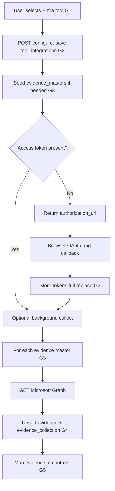

# Microsoft Entra ID — IDP integration (complete flow)

This document describes the **Microsoft Entra** integrations implemented under [`app/integrations/categories/idp/microsoft_entra/`](../app/integrations/categories/idp/microsoft_entra/). The **generic** rules for tables, uniqueness, and control mapping live in **[0001 - initialising.md](0001%20-%20initialising.md)**. Generic steps are labeled **G1–G5** and apply to both **commercial (worldwide)** and **GCC High (US sovereign)** variants.

---

## Two products: commercial vs GCC High

You register **two separate tools** in your catalog (two `tool_id` values) if you need both clouds.

| Aspect | Commercial (worldwide) | GCC High (Azure Government) |
|--------|-------------------------|-----------------------------|
| Provider registry key | `microsoft_entra` | `microsoft_entra_gcc_high` |
| Login / token authority | `https://login.microsoftonline.com` | `https://login.microsoftonline.us` |
| Microsoft Graph API base | `https://graph.microsoft.com/v1.0` | `https://graph.microsoft.us/v1.0` |
| App registration portal | [Azure Portal](https://portal.azure.com) (typical) | [Azure Government Portal](https://portal.azure.us) |
| HTTP API prefix | `/api/v1/integrations/entra` | `/api/v1/integrations/entra-gcc-high` |
| IDP alias prefix | `/idp/entra` | `/idp/entra-gcc-high` |
| OAuth callback | `/idp/entra/callback` | `/idp/entra-gcc-high/callback` |
| Evidence collect | `POST /api/v1/evidence/entra/collect` | `POST /api/v1/evidence/entra-gcc-high/collect` |

`configuration_data` stores `national_cloud` as `commercial` or `gcc_high` (set automatically from which **configure** route you used). Use the matching routes for **flow**, **status**, **refresh-tokens**, **authorize**, **callback**, and **collect** for that integration.

---

## Relationship to `0001 - initialising.md`

| Generic step | What it means for Microsoft Entra |
|--------------|-----------------------------------|
| **G1** — User selects tool and supplies data | User picks the Entra tool (commercial or GCC High `tool_id`) and calls **POST …/configure** with `org_id`, `user_id`, `tool_id`, and `configuration_data` (at minimum `tenant_id` when using server-side app credentials). |
| **G2** — Persist in `tool_integrations` | Same as generic: one row per `(organization_id, tool_id)`; **full replace** on update. OAuth tokens and shell config live in `configuration_data` (including `oauth_clients` after OAuth). |
| **G3** — Resolve `evidence_masters` | **POST …/configure** seeds `evidence_masters` for this `tool_id` (see inventory table below). Collectors key off **`code`** (e.g. `IDP_DIRECTORY_USERS`). |
| **G4** — `evidence` + `evidence_collection` | Call Microsoft Graph with Bearer token; upsert **`evidence`** by `organization_id` + `title`; insert **`evidence_collection`** with `source` = `Microsoft Graph` and the Graph payload in `tool_evidence`. |
| **G5** — `evidence_mappeds` | Same as Zoho: `evidence_masters.id` → `control_evidence_master` → controls; **`evidence_mappeds`** links the saved **`evidence`** row to each control. |

**Uniqueness and full replace** (same as `0001`):

- **`tool_integrations`**: unique `(organization_id, tool_id)` — update in place; **full replace** `configuration_data` when reconnecting.
- **`evidence`**: unique `(organization_id, title)` per org — re-collection **updates** that row; replace content as implemented in persistence.

---

## Credentials: environment (Vanta-style) or BYO

### Option A — Server-side app registration (recommended UX)

Set in `.env` (see [`app/config.py`](../app/config.py)):

**Commercial**

- `ENTRA_CLIENT_ID`
- `ENTRA_CLIENT_SECRET`
- `ENTRA_REDIRECT_URI` (must match the app registration; e.g. `http://localhost:8006/idp/entra/callback`)

**GCC High**

- `ENTRA_GCC_HIGH_CLIENT_ID`
- `ENTRA_GCC_HIGH_CLIENT_SECRET`
- `ENTRA_GCC_HIGH_REDIRECT_URI` (e.g. `http://localhost:8006/idp/entra-gcc-high/callback`)

The UI does **not** need to send `client_id` / `client_secret` if these are set.

### Option B — Bring-your-own (BYO)

You may still pass **`client_id`** and **`client_secret`** (and **`redirect_uri`**) inside **`configuration_data`**; they override the environment for that integration.

---

## HTTP API reference (FastAPI)

Mounted via [`app/integrations/api.py`](../app/integrations/api.py). Default port in config is **8006**; adjust host/port in examples to match your deployment.

### Configure and integration shell

| Method | Path (commercial) | Path (GCC High) |
|--------|---------------------|-----------------|
| POST | `/api/v1/integrations/entra/configure` | `/api/v1/integrations/entra-gcc-high/configure` |
| POST | `/idp/entra/integrations` | `/idp/entra-gcc-high/integrations` |

**Behavior**

- Persists **`tool_integrations`** (G2).
- Seeds **`evidence_masters`** for this `tool_id` if missing (G3).
- If no access token yet: returns **`authorization_url`** and **`state`** for the browser.
- If tokens already present: queues **background evidence collection** (same as post-OAuth).

### Flow, status, refresh

| Method | Commercial | GCC High |
|--------|------------|----------|
| GET | `/api/v1/integrations/entra/flow?org_id=&tool_id=` | `/api/v1/integrations/entra-gcc-high/flow?...` |
| GET | `/api/v1/integrations/entra/status?org_id=&tool_id=` | `.../entra-gcc-high/status?...` |
| POST | `/api/v1/integrations/entra/refresh-tokens` | `.../entra-gcc-high/refresh-tokens` |

Request body for refresh: `{ "org_id", "tool_id", "force": false }`.

### OAuth (browser)

| Step | Commercial | GCC High |
|------|------------|----------|
| Optional authorize URL | `GET /api/v1/oauth/entra/authorize?org_id=&tool_id=` | `GET /api/v1/oauth/entra-gcc-high/authorize?...` |
| Redirect callback | `GET /idp/entra/callback?code=&state=` | `GET /idp/entra-gcc-high/callback?...` |

After a successful code exchange, tokens are stored on **`tool_integrations`**, and **evidence collection runs in the background** when `user_id` is available on the integration row.

If **`post_oauth_success_redirect_url`** is set in settings, successful callbacks **302 redirect** to that UI URL instead of returning JSON.

### Evidence collection (manual re-run or debugging)

| Cloud | Path |
|-------|------|
| Commercial | `POST /api/v1/evidence/entra/collect` |
| GCC High | `POST /api/v1/evidence/entra-gcc-high/collect` |

Body (same shape as Zoho collect): `org_id`, `user_id`, `tool_id`, optional `evidence_codes`, optional `date_from` / `date_to` (not used for directory snapshots in the current Graph collectors).

---

## Initial payload examples

### Minimal (env holds client id, secret, redirect)

**Commercial — POST `/api/v1/integrations/entra/configure`**

```json
{
  "org_id": "019ce23e-66b9-71fa-8223-8d66f1925bd5",
  "user_id": "019ce23e-67e0-702e-957d-ab3af1f8a619",
  "tool_id": "019ce23d-c16d-7304-a8b5-3500e3cbadbc",
  "configuration_data": {
    "tenant_id": "common"
  }
}
```

Use a **directory (tenant) ID** or **domain** instead of `common` when you need a single-tenant sign-in experience.

### BYO credentials in body

```json
{
  "org_id": "019ce23e-66b9-71fa-8223-8d66f1925bd5",
  "user_id": "019ce23e-67e0-702e-957d-ab3af1f8a619",
  "tool_id": "019ce23d-c16d-7304-a8b5-3500e3cbadbc",
  "configuration_data": {
    "tenant_id": "xxxxxxxx-xxxx-xxxx-xxxx-xxxxxxxxxxxx",
    "client_id": "your-app-client-id",
    "client_secret": "your-secret",
    "redirect_uri": "http://localhost:8006/idp/entra/callback"
  }
}
```

For **GCC High**, use the **entra-gcc-high** configure URL and matching **`redirect_uri`** registered in Azure Government.

---

## Phase A — OAuth and Microsoft Graph

1. User opens **`authorization_url`** (or completes the flow from **configure**).
2. User signs in; admin **consent** may be required for delegated permissions such as **User.Read.All** and **Group.Read.All** (see [`constants.py`](../app/integrations/categories/idp/microsoft_entra/constants.py)).
3. Microsoft redirects to **`redirect_uri`** with `code` and `state`.
4. This API exchanges the code for **`access_token`** and **`refresh_token`** (delegated flow) and persists them under **`configuration_data.oauth_clients`** (full replace semantics per integration design).
5. **Background task** runs **`run_entra_evidence_collection`** when `tool_integrations.user_id` is set (same pattern as Zoho).

Until tokens exist, Graph-backed collectors will fail fast with a clear error.

---

## Phase B — Evidence inventory (G3)

Seeded **`evidence_masters`** rows (see [`seed.py`](../app/integrations/categories/idp/microsoft_entra/seed.py)):

| # | Master `name` (also `evidence.title`) | `code` | Graph (conceptual) |
|---|----------------------------------------|--------|---------------------|
| 1 | Directory Users | `IDP_DIRECTORY_USERS` | `GET /users` (paginated) |
| 2 | Directory Groups | `IDP_DIRECTORY_GROUPS` | `GET /groups` (paginated) |

`source` in **`evidence_masters`**: `microsoft_entra` (commercial) or `microsoft_entra_gcc_high` (GCC High), set at seed time.

---

## Phase C — Collect and persist (G4)

For each selected evidence master:

1. Ensure access token is valid (**refresh** if needed via [`token_refresh.py`](../app/integrations/categories/idp/microsoft_entra/token_refresh.py)).
2. Call Microsoft Graph using the resolved **Graph base URL** for the cloud.
3. **`upsert_evidence_full_replace`**: `title` = master `name`, `code` = master `code`.
4. **`insert_evidence_collection`**: stores normalized Graph payload in **`evidence_collections.tool_evidence`**, with `source` = `Microsoft Graph`.

Large tenants: pagination follows **`@odata.nextLink`** up to a safety cap (`MAX_GRAPH_PAGES` in [`constants.py`](../app/integrations/categories/idp/microsoft_entra/constants.py)).

---

## Phase D — Map to controls (G5)

Identical model to **[0001 - initialising.md](0001%20-%20initialising.md)** and Zoho:

- **`remap_evidence_to_controls`** deletes prior **`evidence_mappeds`** for that **`evidence_id`** and inserts new rows for every **`control_id`** linked via **`control_evidence_master`** for this **`evidence_master_id`**.

---

## End-to-end sequence (summary)



---

## Debugging

- Set **`ENTRA_DEBUG_HTTP=1`** in the environment to log token and Graph HTTP responses (see [`oauth.py`](../app/integrations/categories/idp/microsoft_entra/oauth.py), [`collector.py`](../app/integrations/categories/idp/microsoft_entra/collector.py)).

---

## References

- **[0001 - initialising.md](0001%20-%20initialising.md)** — generic GRC data model and uniqueness.
- **[0002 - zoho_integration.md](0002%20-%20zoho_integration.md)** — parallel HRMS integration (same persistence patterns).
- **Microsoft Learn** — [Microsoft Graph national cloud deployments](https://learn.microsoft.com/en-us/graph/deployments), Entra app registration, and delegated permissions.
