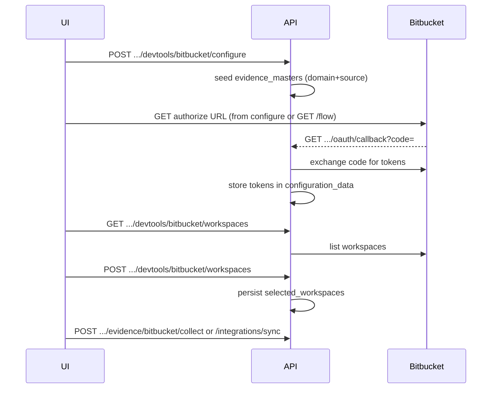

# Bitbucket Cloud integration

## Overview

This integration follows the same persistence patterns as Zoho / Microsoft Entra (`tool_integrations`, domain-scoped `evidence_masters`, `configuration_data` for OAuth tokens) and adds a **Vanta-style** second step: after OAuth, the user **selects Bitbucket workspaces** to sync before evidence collection runs.

## OAuth app (Atlassian)

1. Create an OAuth 2.0 (3LO) app in the [Atlassian Developer Console](https://developer.atlassian.com/console/myapps/).
2. Use **Bitbucket** as the product.
3. Register this **exact** callback URL (adjust host/port to match uvicorn):

   `http://localhost:8006/api/v1/integrations/devtools/bitbucket/oauth/callback`

4. Copy **Client ID** and **Secret** into `.env`:

   - `BITBUCKET_CLIENT_ID`
   - `BITBUCKET_CLIENT_SECRET`
   - `BITBUCKET_REDIRECT_URI` (same as above)

5. Optional: `BITBUCKET_OAUTH_SCOPES` — space-separated scopes (defaults: read-only repo, PR, issue, account).

## Flow

## HTTP routes

| Method | Path | Purpose |
|--------|------|---------|
| POST | `/api/v1/integrations/devtools/bitbucket/configure` | Upsert integration + seed masters |
| GET | `/api/v1/integrations/devtools/bitbucket/flow` | OAuth / workspace step hints |
| GET | `/api/v1/integrations/devtools/bitbucket/status` | Masked `configuration_data` |
| GET | `/api/v1/oauth/bitbucket/authorize` | Authorization URL + state |
| GET | `/api/v1/integrations/devtools/bitbucket/oauth/callback` | OAuth redirect target |
| GET | `/api/v1/integrations/devtools/bitbucket/workspaces` | List workspaces for token |
| POST | `/api/v1/integrations/devtools/bitbucket/workspaces` | Body: `org_id`, `tool_id`, `workspace_slugs` |
| POST | `/api/v1/evidence/bitbucket/collect` | Evidence pull |
| POST | `/api/v1/integrations/sync` | Unified sync (`provider_key`: `bitbucket_cloud`) |

## Evidence

- `evidence_masters.source` = `bitbucket_cloud` (seeded per tool domain).
- `tool_integrations.tool_id` must reference a **tools** row with **`domain_id`** set.

## Troubleshooting

- **404 on configure**: ensure the URL uses `devtools/bitbucket` (see `static/index.html` tester).
- **Workspace selection fails**: slugs must appear in the GET `/workspaces` response for the current token.
- **Token errors**: refresh runs automatically before listing workspaces when `access_token_expires_at` is near expiry.
