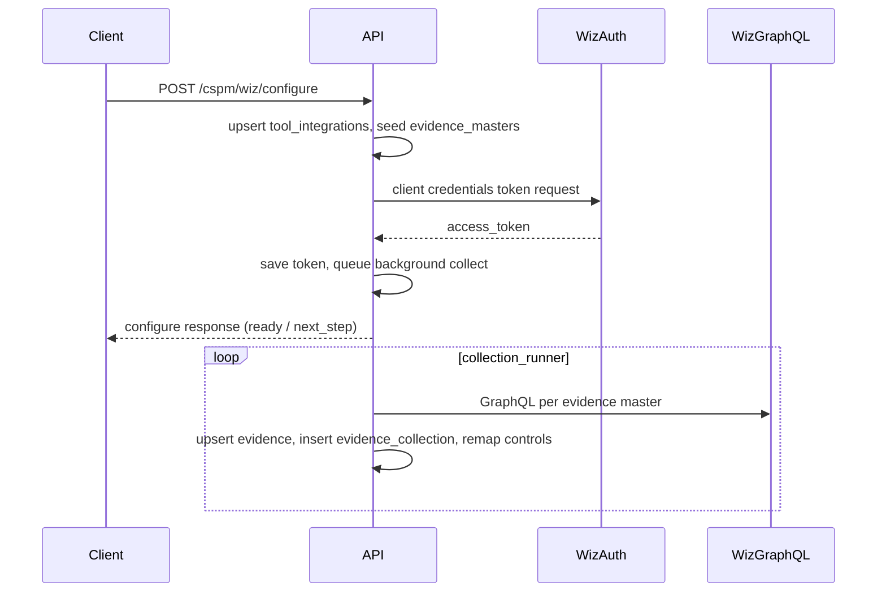

# Wiz CSPM — integration (complete flow)

This document describes the **Wiz** integration under [`app/integrations/categories/cspm/wiz/`](../app/integrations/categories/cspm/wiz/). Generic GRC steps **G1–G5** are defined in **[0001 - initialising.md](0001%20-%20initialising.md)**. See the **[integrations index](0000%20-%20integrations_index.md)** for all tools.

---

## Relationship to `0001 - initialising.md`

| Generic step | What it means for Wiz |
|--------------|------------------------|
| **G1** | User selects **Wiz CSPM** and **POST …/configure** with `graphql_url`, service account `client_id` / `client_secret`, and optional `auth_url` / `audience` (see [`credentials.py`](../app/integrations/categories/cspm/wiz/credentials.py)). |
| **G2** | **`tool_integrations.configuration_data`** stores tokens after **client-credentials** exchange; updates are **full replace**. |
| **G3** | **POST …/configure** seeds **`evidence_masters`** for this tool’s **`domain_id`** with **`source` = `wiz`** (see [`seed_service.py`](../app/integrations/categories/cspm/wiz/seed_service.py)). |
| **G4** | Collectors call **Wiz GraphQL**; **`upsert_evidence_full_replace`**; **`insert_evidence_collection`** with `source` = `Wiz GraphQL API`. |
| **G5** | **`remap_evidence_to_controls`** as usual via **`evidence_master_id`**. |

---

## Provider registry

| Item | Value |
|------|--------|
| `evidence_masters.source` | `wiz` |
| Unified sync `provider_key` | `wiz` |
| Package | [`app/integrations/categories/cspm/wiz/`](../app/integrations/categories/cspm/wiz/) |
| Orchestration | [`collection_runner.py`](../app/integrations/categories/cspm/wiz/collection_runner.py) |
| Token | [`token_refresh.py`](../app/integrations/categories/cspm/wiz/token_refresh.py) (client credentials) |

**No browser OAuth** — configure exchanges credentials for an **`access_token`** server-side.

---

## HTTP API (FastAPI)

Base URL examples use `http://localhost:8006`; adjust to your **`app_port`**.

### Configure, flow, status, refresh

| Method | Path | Purpose |
|--------|------|---------|
| POST | `/api/v1/integrations/cspm/wiz/configure` | Upsert **`tool_integrations`**, seed masters, obtain access token, queue **background** full collection if ready. |
| GET | `/api/v1/integrations/cspm/wiz/flow?org_id=&tool_id=` | Whether credentials/token allow collection. |
| GET | `/api/v1/integrations/cspm/wiz/status?org_id=&tool_id=` | Masked **`configuration_data`**. |
| POST | `/api/v1/integrations/cspm/wiz/refresh-tokens` | Body: `{ "org_id", "tool_id", "force": false }` — new token via client credentials. |

### Evidence collection

| Method | Path | Purpose |
|--------|------|---------|
| POST | `/api/v1/evidence/wiz/collect` | Same collection as after configure; returns **`CollectEvidenceResponse`** with per-code **`results`**. |

### Unified sync

| Method | Path | Body hint |
|--------|------|-----------|
| POST | `/api/v1/integrations/sync` | `provider_key`: **`wiz`** (or omit if domain only has Wiz sources). |

---

## Sample `configuration_data`

```json
{
  "graphql_url": "https://api.us1.app.wiz.io/graphql",
  "client_id": "<wiz-service-account-client-id>",
  "client_secret": "<wiz-service-account-secret>",
  "auth_url": "https://auth.app.wiz.io/oauth/token",
  "audience": "wiz-api"
}
```

Exact keys are resolved in **`credentials.py`**; **`access_token`** is written into **`configuration_data`** after a successful token exchange.

---

## End-to-end flow



---

## Troubleshooting

- **Configure fails on token exchange** — Check **`graphql_url`**, **`auth_url`**, **`audience`**, and service account permissions in Wiz.
- **No masters** — Ensure **`POST /configure`** ran for this **`tool_id`** and domain; seeds are skipped if evidence **codes** already exist **globally** (see seed service).
- **Sync ambiguous** — If multiple **`source`** values exist on the same domain, pass **`provider_key`: `"wiz"`** explicitly.

---

## References

- **[0000 - integrations_index.md](0000%20-%20integrations_index.md)** — all integrations.
- **[0001 - initialising.md](0001%20-%20initialising.md)** — generic model.
