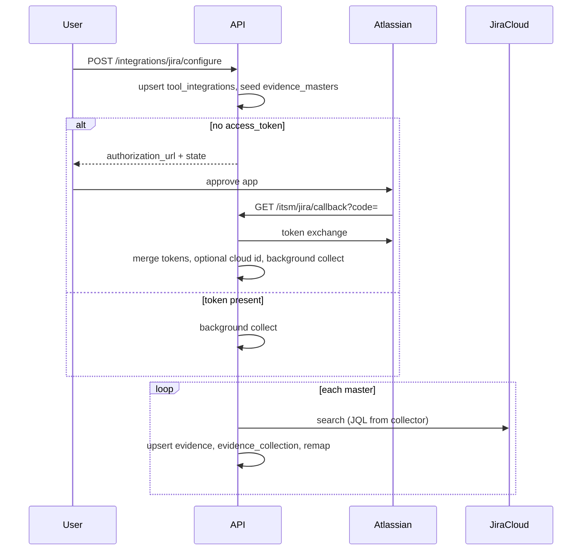

# Jira Cloud (ITSM) — integration (complete flow)

This document describes **Jira Cloud** under [`app/integrations/categories/itsm/jira/`](../app/integrations/categories/itsm/jira/). Generic steps **G1–G5** are in **[0001 - initialising.md](0001%20-%20initialising.md)**. See **[0000 - integrations_index.md](0000%20-%20integrations_index.md)** for all tools.

---

## Relationship to `0001 - initialising.md`

| Generic step | What it means for Jira |
|--------------|------------------------|
| **G1** | User submits Atlassian **OAuth** app settings + optional **JQL scope** (`project_keys`, `default_jql`, or per-code **`jql_overrides`**) in **`configuration_data`**. |
| **G2** | **`tool_integrations`** holds OAuth tokens and **`atlassian_cloud_id`** (from accessible resources or first collect). **Full replace** on updates. |
| **G3** | **POST …/configure** seeds ITSM **`evidence_masters`** with **`source` = `jira_cloud`** (see [`seed_service.py`](../app/integrations/categories/itsm/jira/seed_service.py)). |
| **G4** | [**Jira REST search**](https://developer.atlassian.com/cloud/jira/platform/rest/v3/) via `POST .../rest/api/3/search` (wrapped in [`api_client.py`](../app/integrations/categories/itsm/jira/api_client.py)); **`upsert_evidence_full_replace`**; **`insert_evidence_collection`**. |
| **G5** | **`remap_evidence_to_controls`** as usual. |

---

## Provider registry

| Item | Value |
|------|--------|
| `evidence_masters.source` | `jira_cloud` |
| Unified sync `provider_key` | `jira_cloud` |
| OAuth | Atlassian 3LO — [`oauth.py`](../app/integrations/categories/itsm/jira/oauth.py); default scopes: `read:jira-work read:jira-user offline_access` ([`constants.py`](../app/integrations/categories/itsm/jira/constants.py)) |

---

## HTTP API (FastAPI)

### Configure and alias

| Method | Path | Purpose |
|--------|------|---------|
| POST | `/api/v1/integrations/jira/configure` | Upsert integration, seed masters, return **authorization URL** if no access token, or queue **background** collect if token present. |
| POST | `/itsm/jira/integrations` | Same as configure (alias). |

### Flow, status, refresh

| Method | Path | Purpose |
|--------|------|---------|
| GET | `/api/v1/integrations/jira/flow?org_id=&tool_id=` | OAuth status + **`authorization_url`** / **`state`** when needed. |
| GET | `/api/v1/integrations/jira/status?org_id=&tool_id=` | Masked **`configuration_data`**. |
| POST | `/api/v1/integrations/jira/refresh-tokens` | Body: `{ "org_id", "tool_id", "force": false }` — refresh Atlassian access token. |

### OAuth (browser)

| Method | Path | Purpose |
|--------|------|---------|
| GET | `/api/v1/oauth/jira/authorize?org_id=&tool_id=` | JSON with **`authorization_url`** and **`state`**. |
| GET | `/itsm/jira/callback?code=&state=` | Exchange code, store tokens, resolve **cloud id** when possible, queue **background** collection. |

Register the **same** callback URL in the Atlassian developer app (e.g. `http://localhost:8006/itsm/jira/callback` — host/port must match uvicorn).

### Evidence collection

| Method | Path | Purpose |
|--------|------|---------|
| POST | `/api/v1/evidence/jira/collect` | Full or filtered collect; synchronous **`results`** in response. |

### Unified sync

| Method | Path | Body hint |
|--------|------|-----------|
| POST | `/api/v1/integrations/sync` | `provider_key`: **`jira_cloud`** when needed. |

---

## `configuration_data` essentials

**OAuth (required for API):**

- `client_id`, `client_secret`, `redirect_uri` (must match Atlassian app).

**JQL / scope (required for collection):** at least one of:

- **`project_keys`** — comma-separated or list, e.g. `"PROJ,ITSM"`, or
- **`default_jql`** — single JQL string used when no per-code override exists, or
- **`jql_overrides`** — map of **`EV-xx`** → JQL string.

If none of these are set, collection fails when building JQL (see [`collector.py`](../app/integrations/categories/itsm/jira/collector.py)).

**Stored after OAuth:**

- `access_token`, `refresh_token`, optional `atlassian_cloud_id`, `atlassian_site_url`.

---

## End-to-end flow

---

## Troubleshooting

- **Redirect mismatch** — **`redirect_uri`** in config and in Atlassian app must match **exactly** (scheme, host, port, path).
- **No `atlassian_cloud_id`** — Callback or **`ensure_cloud_id_in_config`** on collect calls **`/oauth/token/accessible-resources`**; token needs Jira access.
- **Empty Jira results** — Tune **`project_keys`** / JQL; defaults use keyword **`text ~`** from evidence **name** (see collector).
- **Seed skipped** — If an **EV-** code already exists in **`evidence_masters`** for **any** domain, that code is not re-inserted for Jira (global uniqueness check).

---

## References

- **[0000 - integrations_index.md](0000%20-%20integrations_index.md)** — all integrations.
- **[0001 - initialising.md](0001%20-%20initialising.md)** — generic model.
