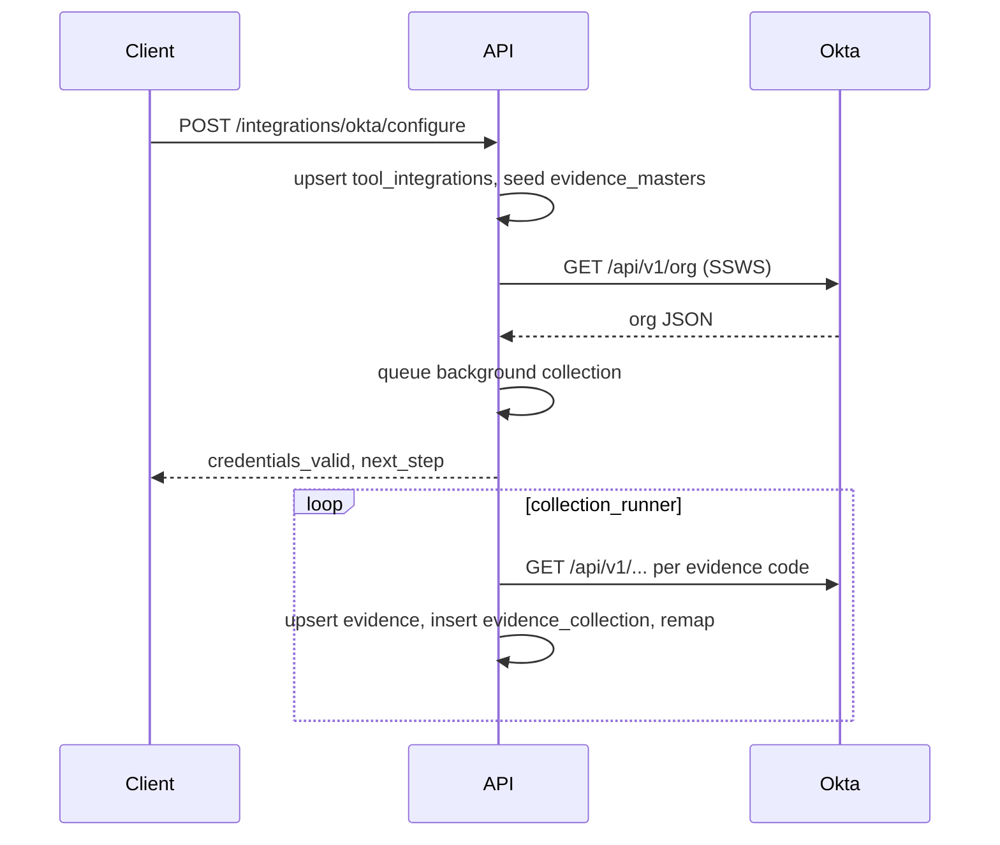

# Okta (IAM) — integration (complete flow)

This document describes **Okta** under [`app/integrations/categories/idp/okta/`](../app/integrations/categories/idp/okta/). Generic steps **G1–G5** are in **[0001 - initialising.md](0001%20-%20initialising.md)**. See **[0000 - integrations_index.md](0000%20-%20integrations_index.md)** for all tools.

---

## Relationship to `0001 - initialising.md`

| Generic step | What it means for Okta |
|--------------|------------------------|
| **G1** | User **POST …/configure** with **`org_domain`** (Okta org URL) and **`api_token`** (SSWS API token). No browser OAuth. |
| **G2** | **`tool_integrations.configuration_data`** stores **`org_domain`** and **`api_token`**; **full replace** on update. **`api_token`** is masked in status responses. |
| **G3** | Configure seeds IAM **`evidence_masters`** with **`source` = `okta`** and category **IAM** (see [`seed_service.py`](../app/integrations/categories/idp/okta/seed_service.py)). |
| **G4** | Collectors call **Okta Management API** with header **`Authorization: SSWS {api_token}`**; **`upsert_evidence_full_replace`**; **`insert_evidence_collection`** with `source` = `Okta Admin API`. |
| **G5** | **`remap_evidence_to_controls`** as usual. |

---

## Provider registry

| Item | Value |
|------|--------|
| `evidence_masters.source` | `okta` |
| Unified sync `provider_key` | `okta` |
| API style | REST ([Okta Management API](https://developer.okta.com/docs/reference/core-okta-api/)) |

---

## Org URL normalization

**`org_domain`** may be the **admin** console host, e.g. `https://tenant-admin.okta.com/`. The integration normalizes to the **API** host by replacing **`-admin.okta.com`** with **`.okta.com`** (see [`credentials.py`](../app/integrations/categories/idp/okta/credentials.py)) so calls go to `https://tenant.okta.com/api/v1/...`.

---

## HTTP API (FastAPI)

### Configure and alias

| Method | Path | Purpose |
|--------|------|---------|
| POST | `/api/v1/integrations/okta/configure` | Upsert integration, seed masters, **`GET /api/v1/org`** to validate token; on success queue **background** full collection. |
| POST | `/idp/okta/integrations` | Same as configure (alias). |

### Flow and status

| Method | Path | Purpose |
|--------|------|---------|
| GET | `/api/v1/integrations/okta/flow?org_id=&tool_id=` | Whether token can read org (re-validates). |
| GET | `/api/v1/integrations/okta/status?org_id=&tool_id=` | Masked **`configuration_data`** (`api_token` → `***`). |

There is **no** OAuth **authorize**/**callback** or **refresh-tokens** route for Okta in this integration (long-lived API token).

### Evidence collection

| Method | Path | Purpose |
|--------|------|---------|
| POST | `/api/v1/evidence/okta/collect` | Synchronous per-code **`results`** (use when you need completion in the HTTP response). |

### Unified sync

| Method | Path | Body hint |
|--------|------|-----------|
| POST | `/api/v1/integrations/sync` | `provider_key`: **`okta`** when the domain’s source is not unique. |

---

## Sample request body (`ToolIntegrationPayload`)

```json
{
  "org_id": "<organization UUID>",
  "user_id": "<user UUID>",
  "tool_id": "<Okta tool UUID>",
  "configuration_data": {
    "org_domain": "https://your-org-admin.okta.com/",
    "api_token": "<SSWS API token>"
  }
}
```

Optional aliases for org URL: **`okta_org_url`**, **`base_url`** (see **`resolve_org_domain_raw`** in **`credentials.py`**).

---

## Configure vs collect timing

- **POST …/configure** — On **successful** org validation, collection is **queued in the background** (FastAPI **BackgroundTasks**). The HTTP response returns **before** all evidence rows are finished.
- **POST …/evidence/okta/collect** — Runs collection **in the request** and returns **`results`** for each evidence code.

---

## Evidence catalog

**Codes, names, and category** are defined once in **[`iam_evidence_catalog.py`](../app/integrations/categories/idp/iam_evidence_catalog.py)** (same **`EV-37`…`EV-522`** list as Microsoft Entra). Okta adds Admin API path hints in [`evidence_map.py`](../app/integrations/categories/idp/okta/evidence_map.py). Each code maps to one or more Admin API **GET** steps in [`collector.py`](../app/integrations/categories/idp/okta/collector.py).

Because **`evidence_masters.code`** is **globally unique**, the same **`EV-xx`** cannot exist twice; if Entra (or another IDP) already created a row for a code, Okta seed may **skip** that code.

Some endpoints (e.g. **logs**) require sufficient **token permissions**; a missing scope may surface as a **failed** row for that code only.

---

## End-to-end flow



---

## Troubleshooting

- **401 / 403 on collect** — Token lacks required admin scopes for some resources; rotate token with broader permissions if needed.
- **Seed skipped** — Evidence **code** already exists **globally** in **`evidence_masters`**; new domain will not duplicate that code (see seed service).
- **Flow returns not ready** — Fix **`org_domain`** format and ensure **`api_token`** is valid for **`GET /api/v1/org`**.

---

## References

- **[0000 - integrations_index.md](0000%20-%20integrations_index.md)** — all integrations.
- **[0001 - initialising.md](0001%20-%20initialising.md)** — generic model.
