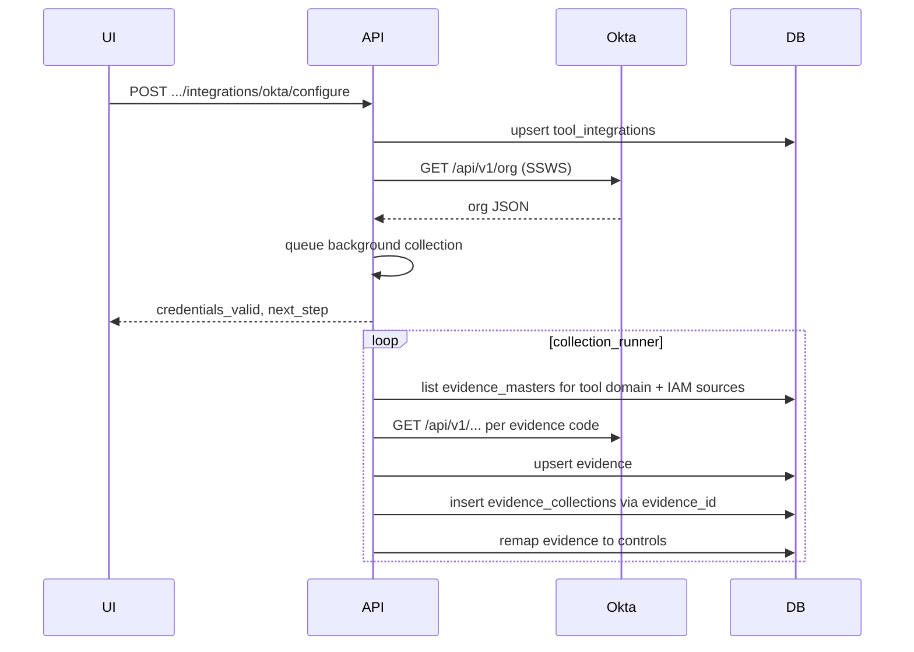

# Okta (IAM integration)

Per-tool index: **[0000 - integrations_index.md](0000%20-%20integrations_index.md)**. Generic steps **G1-G5**: **[0001 - initialising.md](0001%20-%20initialising.md)**.

## Overview

This integration stores Okta credentials in **`tool_integrations`**, validates them with **`GET /api/v1/org`**, then collects IAM evidence from the Okta Management API. Collection writes to **`evidence`** first and then inserts run payloads into **`evidence_collections`** through **`evidence_id`**.

The IAM catalog is shared with other IDP providers. In current databases, IAM master rows usually use **`source = iam`**; older databases may still contain **`iam_catalog`** or other legacy IAM source tags. The Okta collector must accept those legacy source values when resolving **`evidence_masters`** for the tool domain.

## Relationship to `0001 - initialising.md`

| Generic step | What it means for Okta |
|--------------|------------------------|
| **G1** | User **POST .../configure** with **`org_domain`** and **`api_token`** (SSWS). No browser OAuth. |
| **G2** | **`tool_integrations.configuration_data`** stores **`org_domain`** and **`api_token`**; updates are **full replace**. Status responses mask `api_token`. |
| **G3** | Collect depends on IAM **`evidence_masters`** existing for the tool's **`domain_id`** and matching an allowed IAM source. |
| **G4** | Collectors call the Okta Management API, **`upsert_evidence_full_replace`**, then **`insert_evidence_collection`**. |
| **G5** | **`remap_evidence_to_controls`** runs after each evidence upsert. |

## Provider registry

| Item | Value |
|------|--------|
| Provider key | `okta` |
| Current shared IAM master source | `iam` |
| Legacy IAM master sources also accepted | `iam_catalog`, `okta`, `microsoft_entra`, `microsoft_entra_gcc_high`, `ping_identity`, `cyberark_identity`, `sailpoint_identitynow`, `google_workspace`, `forgerock`, `onelogin`, `jumpcloud` |
| API style | REST ([Okta Management API](https://developer.okta.com/docs/reference/core-okta-api/)) |

## Org URL normalization

**`org_domain`** may be the admin console host, for example `https://tenant-admin.okta.com/`. The integration normalizes **`-admin.okta.com`** to **`.okta.com`** before API calls, so requests go to `https://tenant.okta.com/api/v1/...`.

## HTTP routes

| Method | Path | Purpose |
|--------|------|---------|
| POST | `/api/v1/integrations/okta/configure` | Upsert integration, validate token, queue background collection |
| POST | `/idp/okta/integrations` | Configure alias |
| GET | `/api/v1/integrations/okta/flow` | Readiness / validation check |
| GET | `/api/v1/integrations/okta/status` | Masked `configuration_data` |
| POST | `/api/v1/evidence/okta/collect` | Synchronous evidence pull |
| POST | `/api/v1/integrations/sync` | Unified sync (`provider_key`: `okta`) |

There is no Okta OAuth authorize/callback flow in this integration.

## Sample configure payload

```json
{
  "org_id": "<organization UUID>",
  "user_id": "<user UUID>",
  "tool_id": "<Okta tool UUID>",
  "configuration_data": {
    "org_domain": "https://your-org-admin.okta.com/",
    "api_token": "<SSWS API token>"
  }
}
```

Optional aliases for the org URL are **`okta_org_url`** and **`base_url`**.

## Flow



## Configure vs collect timing

- **POST .../configure** queues collection in the background after credentials are validated.
- **POST .../evidence/okta/collect** runs collection in-request and returns **`results`** per code.

## Storage model

Okta collection does **not** write directly into **`evidence_collections`** by `tool_id`.

The storage path is:

1. Upsert a row in **`evidence`** using `organization_id`, `tool_id`, `code`, and `title`.
2. Insert a row in **`evidence_collections`** using the returned **`evidence_id`**.
3. Join **`evidence_collections`** back through **`evidence.id`** when checking Okta results.

If you query **`evidence_collections`** directly by `tool_id`, you will not find anything because that column is not present on that table.

## Evidence catalog

The IAM evidence codes and names are defined centrally in **[`iam_evidence_catalog.py`](../app/integrations/categories/idp/iam_evidence_catalog.py)** and reused by Okta and other IAM providers. Okta-specific endpoint hints live in [`evidence_map.py`](../app/integrations/categories/idp/okta/evidence_map.py), and the concrete API fetch logic lives in [`collector.py`](../app/integrations/categories/idp/okta/collector.py).

Because **`evidence_masters.code`** is globally unique, Okta seeding may skip inserts when another IAM integration already created the same EV code.

## Compatibility note

In older or mixed databases, IAM master rows may exist under **`source = iam_catalog`** instead of **`iam`**. If the collector only filters for `iam`, manual collect may return **404** and no Okta rows will be written.

The IAM source filter should therefore include:

- `iam`
- `iam_catalog`
- older vendor-specific IAM source tags listed above

## Troubleshooting

- **Configure succeeds but no rows appear**: verify IAM **`evidence_masters`** exist for the Okta tool's **`domain_id`** and that their **`source`** is included in the IAM filter.
- **Manual collect returns 404**: usually means no matching **`evidence_masters`** were found for the tool domain and allowed sources.
- **Rows exist in `evidence` but not in your query**: join **`evidence_collections`** through **`evidence_id`**. That table does not have `tool_id`.
- **401 / 403 on collect**: the token lacks required admin permissions for some resources.
- **405 / 400 for specific evidence codes**: the integration is running, but one or more Okta endpoints or request shapes need adjustment. Other evidence codes may still succeed.
- **Flow returns not ready**: fix **`org_domain`** format and ensure the token can read **`GET /api/v1/org`**.

---

## References

- **[0000 - integrations_index.md](0000%20-%20integrations_index.md)** - all integrations.
- **[0001 - initialising.md](0001%20-%20initialising.md)** - generic model.
